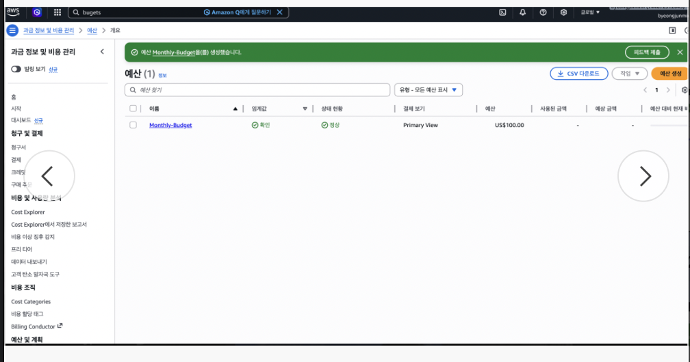
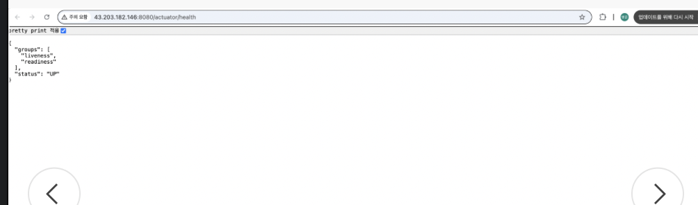
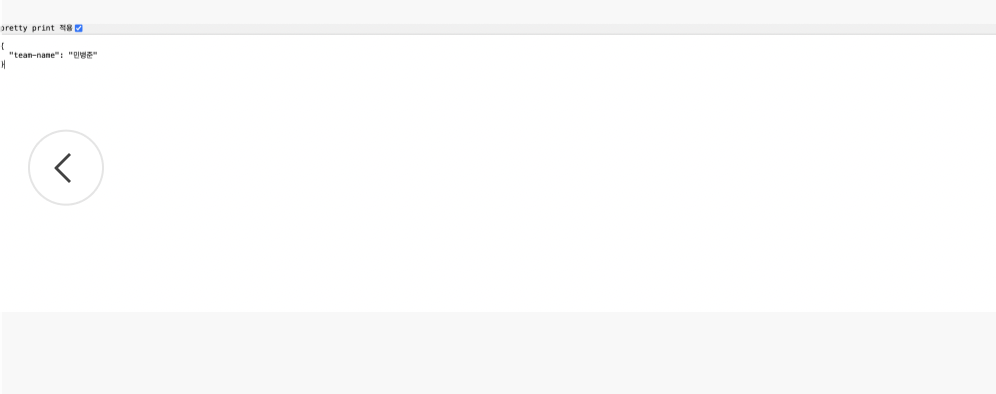
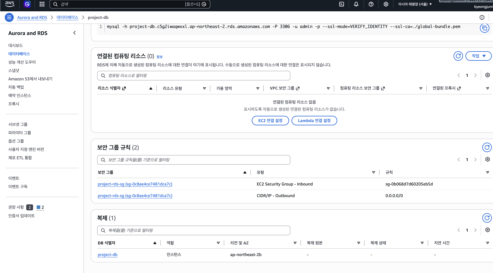
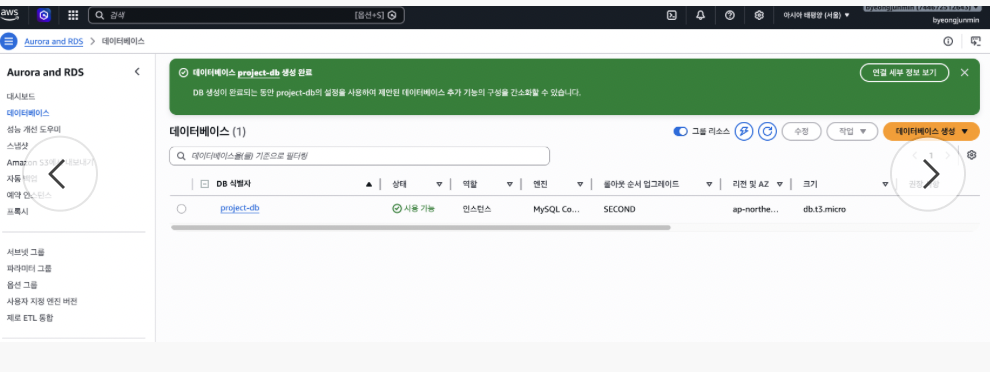
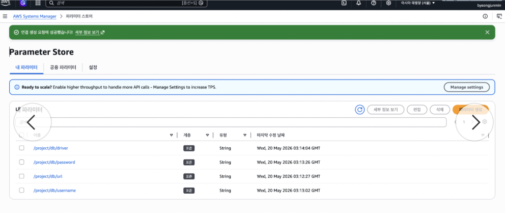
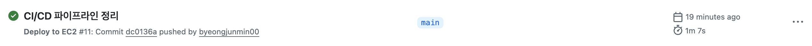
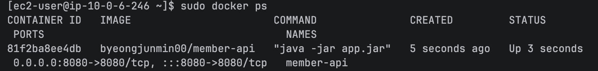

# 팀원 관리 API

Spring Boot로 만든 팀원 관리 API.
AWS 환경(VPC, EC2, RDS, S3)에 배포해서 운영중.

---

## 기술 스택

- Java 21, Spring Boot 4.0.6
- Spring Data JPA, MySQL 8 (RDS)
- AWS S3, Parameter Store
- H2 (로컬용)

---

## LV 0 — 예산 설정

AWS Budgets에서 월 $100 예산 설정하고, 80% 넘으면 이메일 알림 오게 해놓음.



---

## LV 1 — VPC + EC2 + API 구성

### 인프라
- VPC (퍼블릭/프라이빗 서브넷)
- EC2 (Amazon Linux 2023, t3.micro)
- 보안그룹에서 SSH(22), HTTP(8080) 열어둠

### API

| Method | URL | 설명 |
|--------|-----|------|
| POST | `/api/members` | 팀원 등록 |
| GET | `/api/members/{id}` | 팀원 조회 |
| GET | `/actuator/health` | 헬스 체크 |
| GET | `/actuator/info` | 팀 정보 |

### 헬스 체크



### 팀 정보



---

## LV 2 — RDS + Parameter Store

### RDS
- MySQL 8 (db.t3.micro), 프라이빗 서브넷에 넣음
- Security Group Chaining 적용 (RDS 인바운드 소스를 EC2 보안그룹 ID로 설정)





### Parameter Store
DB 접속 정보랑 팀 이름을 Parameter Store에 넣어놓고 EC2에서 환경변수로 주입함.

| 파라미터 | 용도 |
|----------|------|
| `/project/db/url` | DB 접속 URL |
| `/project/db/username` | DB 사용자명 |
| `/project/db/password` | DB 비밀번호 |
| `/project/db/driver` | JDBC 드라이버 |
| `/project/team-name` | 팀 이름 |
| `/project/s3/bucket` | S3 버킷 이름 |



### 프로파일 분리
- `application-local.yaml` → H2 (로컬 개발용)
- `application-prod.yaml` → RDS MySQL (운영, 환경변수로 주입)

---

## LV 3 — S3 이미지 업로드

### S3
- 버킷: `project-member-images-00`
- 퍼블릭 액세스 차단
- IAM Role(`project-ec2-role`)로 EC2에서 접근

### 이미지 API

| Method | URL | 설명 |
|--------|-----|------|
| POST | `/api/members/{id}/profile-image` | 이미지 업로드 |
| GET | `/api/members/{id}/profile-image` | Presigned URL 조회 |

### Presigned URL

7일(604800초) 유효. 브라우저에 붙여넣으면 이미지 확인 가능.

> **Presigned URL:**
> *(제출 직전에 생성해서 붙여넣을 예정)*

### 배포 확인

- Health Check: http://43.203.182.146:8080/actuator/health
- 팀 정보: http://43.203.182.146:8080/actuator/info

---

## LV 4 — Docker + CI/CD

### Docker
- Dockerfile 작성해서 앱을 도커 이미지로 빌드
- 베이스 이미지: `eclipse-temurin:17-jdk-alpine`

### GitHub Actions CI/CD
- main 브랜치에 push하면 자동으로 빌드 + Docker Hub에 이미지 push
- EC2에서 docker pull로 이미지 받아서 실행

### GitHub Actions 성공



### EC2 Docker 컨테이너



---

## 실행 방법

### 로컬
```bash
./gradlew bootRun
```
H2 콘솔: http://localhost:8080/h2-console

### EC2 배포
```bash
# 빌드
./gradlew clean build -x test

# jar 전송
scp -i [키파일] build/libs/member-api-0.0.1-SNAPSHOT.jar ec2-user@[EC2-IP]:~/

# 실행
nohup java -jar member-api-0.0.1-SNAPSHOT.jar --spring.profiles.active=prod &
```


